# MOVIE DATA ANALYSIS

## INTRODUCTION

Welcome to "Movie Data Analysis," a project delving into a comprehensive dataset with 8,790 rows of movie information. In this endeavor, we set out on an engaging journey to uncover hidden narratives within this extensive dataset, employing Python as our primary tool. Our key objectives encompass meticulous data cleaning and the use of visualization tools such as Seaborn or Matplotlib. Through this process, our aim is to unveil patterns, trends, and intriguing insights within the vast world of movie. Join us in this exploration, where the precision of Python-based data cleaning and the creativity of visualization converge to reveal the narratives embedded within 8,790 rows of movie information. The focus is on ensuring data accuracy and clarity in visual representations, offering detailed insights by addressing questions related to the most popular director, movie production trends, top and bottom movie-producing countries, and more. Let's dive into the world of movies and uncover the compelling stories behind the data!

## PROBLEM STATEMENT
1. Calculate the number of days from a movie's release date to the current date
2. Extract the year and month from the date column 
3. Identify the most popular director
4. Determine the top 5 and bottom 5 countries in terms of movie production
5. Analyze and visualize trends in movie production over different years
6. Uncover the most popular country-genre mix
7. Calculate and visualize countries with the highest average movie duration.

By addressing these challenges, this project aims to enrich the exploration of movie data, offering valuable insights through a combination of precise data cleaning and informative visualizations.

## SKILLS AND CONCEPTS DEMONSTRATED
In the exploration of "Movie Data" project using Python, the following skills and concepts are essential to demonstrate:

1. Data Cleaning and Preprocessing:
   - Ability to review and standardize column names and data types
2. Data Visualization with Seaborn or Matplotlib:
   - Proficiency in creating various types of plots, including bar plots, line plots, etc 
   - Skill in customizing visualization elements like colors, labels, titles, and legends
3. Data Analysis and Exploration:
   - Understanding and applying exploratory data analysis (EDA) techniques to identify patterns and trends in the dataset.
4. Statistical Analysis:
   - Employing statistical measures to calculate averages, such as average movie duration.
5. Utilizing Python Libraries and Modules:
   - Competence in using Pandas for data manipulation and analysis
   - Integration of Seaborn or Matplotlib for data visualization.
6. Programming Proficiency in Python:
   - Writing clean, efficient, and well-documented Python code.
7. Annotations and Documentation:
   - Incorporating appropriate annotations in visualizations, including chart titles, axis labels, and legends.
8. Problem Solving and Critical Thinking:
   - Demonstrating problem-solving skills by addressing specific questions posed in the project
   - Applying critical thinking to interpret visualizations and derive meaningful insights.
9. Communication Skills:
   - Effectively communicating findings and insights derived from the data.

By showcasing proficiency in these skills and concepts, the project demonstrates a holistic understanding of data analysis, visualization, and interpretation using Python tools within the context of cinematic data exploration.

## STAGES TO NAVIGATE IN THE MOVIE DATA ANALYSIS PROJECT

The project comprises four critical stages essential for successful completion, which encompass:
1. Libraries and Data Importation
2. Data Assessment
3. Data Cleaning
4. Data Manipulation and Data Visualization

#### EXPLANATIONS

1. Libraries and Data Importation:
 ---
 The initial step of this project involves importing essential libraries suitable for the tasks. In this instance, I imported the following libraries: pandas, which is commonly aliased as 'pd' for data importation and manipulation; datetime, aliased as 'dt' to handle date data types; matplotlib.pyplot, aliased as 'plt' for data visualization; and the warnings library to handle any potential warnings encountered during the project.
 
 Once these libraries are imported, the subsequent step is to bring the movie dataset into the Jupyter environment as a DataFrame using the 'pd.read_csv()' function. The dataset is then assigned to a variable named 'df'. Consequently, whenever 'df' is referenced, the movie dataset appears.
 
 Below is the code snippet that accomplishes this task:
 ```python
import pandas as pd
import datetime as dt
import matplotlib.pyplot as plt
import warnings
warnings.filterwarnings('ignore')

df = pd.read_csv(r'C:\Users\HP\Downloads\Python Dataset\Python Project Dataset.csv')
df
```
The output generated by running this code is displayed in the snapshot below. It is essential to note that the ellipsis (...) present in the data importation output after number 4 indicates the existence of additional rows of information that are not fully displayed unless additional lines of code are used.
:----------:


2. Data Assessment:
--- 
Data assessment is the fundamental process of evaluating imported data to determine its suitability and cleanliness for its intended purpose. There are two primary methods of data assessment: virtual assessment and programmatic assessment. In this case, programmatic assessment was utilized, which involves assessing data using codes, especially when dealing with datasets containing numerous rows and columns that cannot be feasibly examined manually.

Several attributes and functions provided by the pandas library were employed for data assessment, including:

- df.shape attribute: Provides the dimensions of the DataFrame (number of rows and columns).
- df.info() function: Displays a concise summary of the DataFrame, including the data types and memory usage.
- df.isnull().sum() function: Counts the number of missing values in each column.
- df.duplicated().sum() function: Counts the number of duplicate rows in the DataFrame.
- df[column_name].value_counts() function: Returns the frequency count of unique values in a specific column.
  
These assessments are illustrated in the snapshots below. The issues detected during the assessment process are outlined in snapshot "D".

A    |B    
:---:|:---:
|

C   |  D
:---:|:---:
|


3. Data Cleaning:
---
Upon assessment, various data issues were detected, including:
- Inconsistent column headers and Non-descriptive column labeling
- Inconsistent labeling of column values
- Incorrect data type for the 'Date' column.

  It is crucial to address these issues to prevent the possibility of drawing misleading conclusions during data analysis.

  To tackle **Inconsistent column headers and Non-descriptive column labeling**, we opted to rename the columns using a dictionary. This dictionary stored the initial column names and their corresponding new names. The dictionary was assigned to a variable called "Col" for easy reference. We utilized the pandas rename function, specifying the columns keyword argument as "Col" to apply the dictionary changes, and set the inplace keyword argument to true to implement the changes in the main dataset.

  For addressing **Inconsistent labeling of column values**, we utilized the pandas replace function. This function allows us to specify old values and their corresponding new values, along with the inplace keyword argument to apply changes directly to the dataset. Columns such as genre, title, country, rating, duration, and ID underwent this transformation, although only the cleaning process for the genre and title columns will be demonstrated in the snapshot below to showcase how inconsistent labeling of column values can be rectified.

  Lastly, to address the **Incorrect data type for the 'Date' column**, we employed the datetime function. Prior to this, we encountered a problem within the date column where opening and closing brackets '()' were found within dates. To resolve this issue, we initially used the startswith string function to identify dates starting with these brackets. We then applied the strip function to remove the brackets and subsequently utilized the pandas datetime function to convert the date column from object data type to date data type. The dayfirst keyword argument of the datetime function was set to true to specify the format of the date.

   Cleaning and Result of Inconsistent column headers and Non-descriptive column labeling
  :-------------------------------------------------------------:
  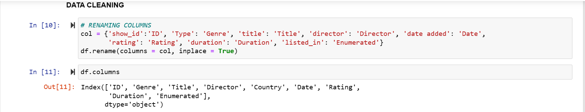

  Cleaning and Result of Inconsistent labeling of column values (Genre)| Cleaning and Result of Inconsistent labeling of column values (Title)  
  :-------------------------------------------------------------:|:---------------------------------------------:
  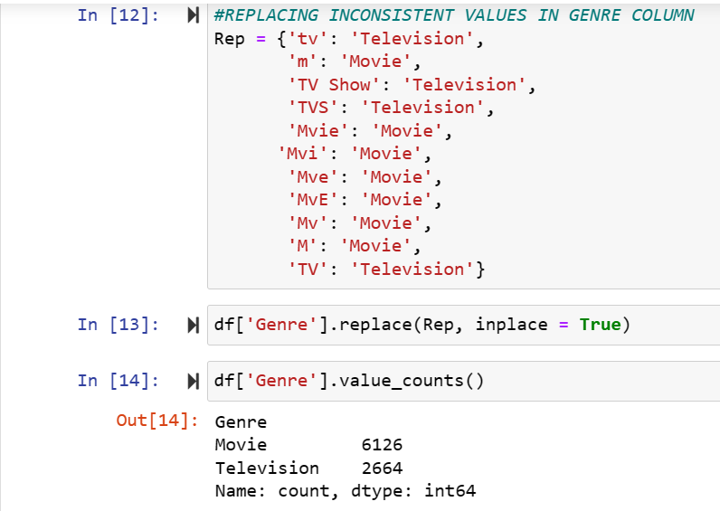                                                     | 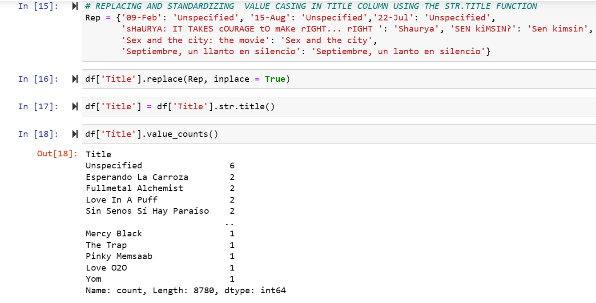
  
   Clening and Result of Incorrect data type for the 'Date' column.
  :-------------------------------------------------------------:
  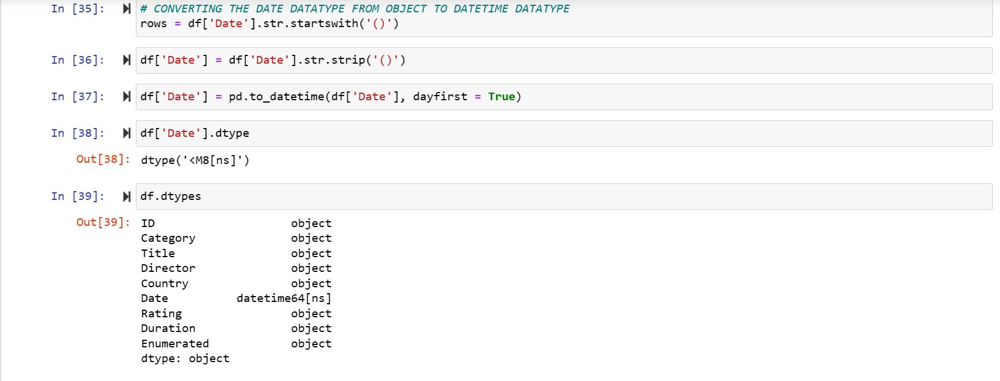

4. Data Manipulation and Visualization (Analysis of the Problem Statement):
---

1. Determine the duration in days from a movie's release date to the present date:
   ---
      
   To compute the duration in days from a movie's release date to the current date, the following syntax can be used:

   ```python
   df['Days_Added'] = (datetime.now() - df['Date']).dt.days
   df.columns
   df
   ```
   Explanation of the code:

   - In the provided code snippet above, the column 'Days_Added' is created in the DataFrame 'df' to store the calculated duration.
   - (datetime.now() - df['Date']).dt.days computes the difference between the current date and the release date of each movie in the 'Date' column of the DataFrame 'df'.
   - The difference is then converted to days using the .dt.days attribute, which extracts the number of days from the calculated duration.
   - In conclusion, the modified DataFrame, now including the newly introduced 'Days_Added' column, is showcased with reference to the variable 'df'. This presentation is illustrated in the snapshot below, where the enhancement is visually emphasized with a yellow highlight.

   DURATION DAYS FROM A MOVIES'S RELEASE DATE TO THE PRESENT DATE
   :------------------------------------------------------------:
   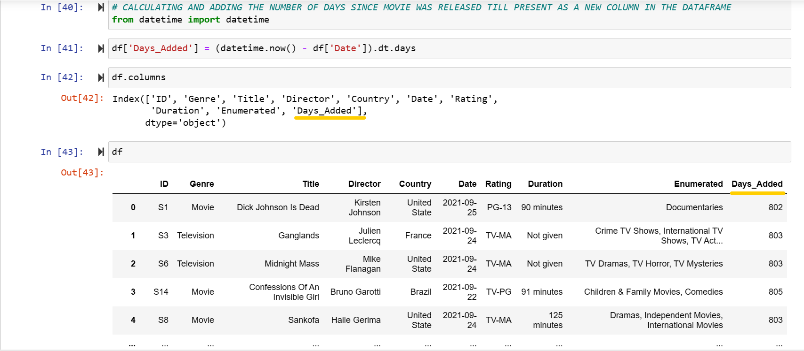
      
2. Extract the year and month from the date column:
   ---

   To extract the year and month from the date column for easier visualization, you can use the following syntax:

   ```python
   df['Year'] = df['Date'].dt.year
   df['Month'] = df['Date'].dt.month
   df.columns
   df
   ```
   Explanation:

   - In the provided code snippet, two new columns 'Year' and 'Month' are created in the DataFrame 'df'.
   - The 'Year' column is populated with the year component extracted from the 'Date' column using the .dt.year attribute.
   - Similarly, the 'Month' column is populated with the month component extracted from the 'Date' column using the .dt.month attribute.
   - Finally, the code displays the columns of the DataFrame 'df' along with the newly added 'Year' and 'Month' columns.

   YEAR AND MONTH COLUMNS CREATED FROM THE DATE COLUMN
   :------------------------------------------------:
   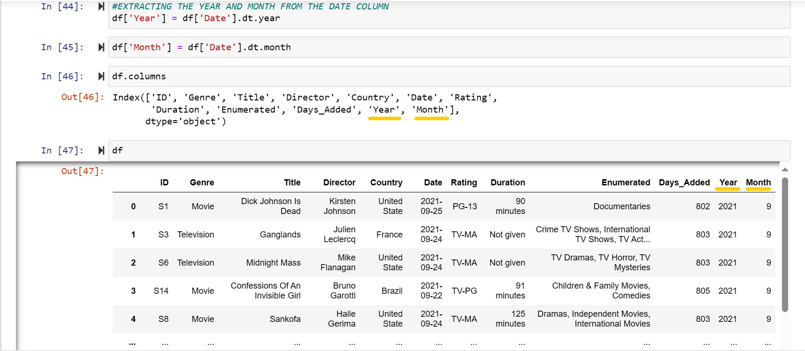

3. Identify the most popular director:
   ---
   To determine the most popular director, we will explore two methods: the counter method and the value counts method.

   Counter Method Syntax
   ```python
   from collections import Counter

   # Using Counter to count occurrences of each director
   directors_counter = Counter(df['Director'])

   # Extracting the most popular director
   most_popular_director = directors_counter.most_common(2)[1:]

   # Displaying the most popular director
   print('The Most popular Director Is:')
   for director, count in most_popular_director:
      print(f"{director}: {count} Occurrences")
   ```
 
   Value Counts Method
   ```python

   # Using value_counts to count occurrences of each director and extracting the most popular one
   most_popular_director = df['Director'].value_counts()[1:].idxmax()

   # Displaying the most popular director
   print(f'The Most Popular Director Is {most_popular_director}: 20 Occurrences')
   ```
   Explanation:
 
   - In the Counter method, we import the Counter class from the collections module to count occurrences of each director in the 'Director' column of the DataFrame 'df'.
   - We then extract the most popular director using the most_common() method and iterate over the result to display the director's name along with the count of occurrences.
   - In the Value Counts method, we use the value_counts() function to count occurrences of each director and extract the most popular one using idxmax().
   - Finally, we print out the most popular director identified by each method, along with the corresponding number of occurrences.
 
   The analysis reveals Rajiv Chilaka as the most popular director with 20 occurrences.

   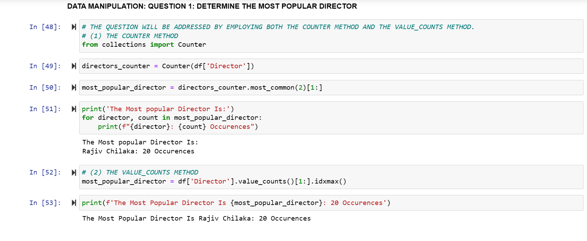

4. Determine the top 5 and bottom 5 countries in terms of movie production:
   ---
   To identify the top 5 and bottom 5 countries in terms of movie production, the following syntax can be used:

   Top 5 Countries:
   ```python
   # Counting occurrences of each country
   country_list = Counter(df['Country'])

   # Extracting the top 5 countries
   my_dict = country_list.most_common(6)
   my_dict.pop(4)

   # Displaying the top 5 countries with the highest movie production
   print('Top 5 Countries With The Highest Movie Production Are:')
   for country, count in my_dict:
      print(f'{country}: {count}')

   # Visualizing the top 5 countries with the highest movie production
   countries, counts = zip(*my_dict)
   fig, ax = plt.subplots(figsize=(12, 6))
   bars = plt.bar(countries, counts, color='yellow')
   plt.xlabel('Country')
   plt.title('TOP 5 COUNTRIES WITH THE HIGHEST MOVIE PRODUCTION')
   plt.xticks(rotation=0)
   plt.yticks([])
   
   # Displaying the country counts on each bar.
   for bar, count in zip(bars, counts):
      plt.text(bar.get_x() + bar.get_width() / 2, bar.get_height(), str(count), ha='center', color='black')
   
   # Eliminating the square lines enclosing the bars or visualization.
   ax.spines['top'].set_visible(False)
   ax.spines['bottom'].set_visible(False)
   ax.spines['right'].set_visible(False)
   ax.spines['left'].set_visible(False)

   plt.show()
   ```
     
   Bottom 5 Countries:
   ```python
   # Counting occurrences of each country
   country_list = Counter(df['Country'])

   # Extracting the bottom 5 countries
   bottom_countries = country_list.most_common()[:-6:-1]

   # Displaying the bottom 5 countries with the lowest movie production
   print('Bottom 5 Countries With The Lowest Movie Production Are:')
   for country, count in bottom_countries:
      print(f'{country}: {count}')
   ```
   Explanation:

   - The code snippet first counts the occurrences of each country using the Counter class from the collections module.
   - For the top 5 countries, it creates a dictionary of the most common countries, excluding the 5th one, and prints out the results.
   - It then visualizes the top 5 countries using a bar plot.
   - For the bottom 5 countries, it creates another dictionary of the least common countries and prints out the results.
     
   The analysis indicates that Cyprus, Puerto Rico, Belarus, Senegal, and Luxembourg have the least movie production, each with 1 occurrence.

   TOP 5             | BOTTOM 5   
   :----------------:|:----------------:
   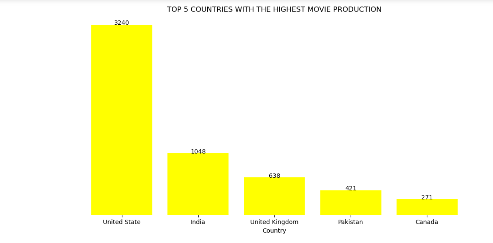|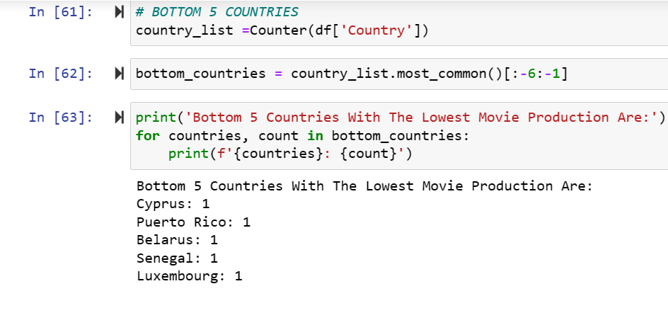

5. Analyze and visualize trends in movie production over different years:
   ---
   To analyze and visualize trends in movie production over different years, you can use the following syntax:

   ```python
   # Counting the number of movies produced each year
   years = df['Year'].value_counts()

   # Creating a figure for the plot
   plt.figure(figsize=(16, 7))

   # Plotting the data using a line chart
   plt.plot(years.index, years.values, marker='*', color='green', label='line Chart', linewidth=1.5)

   # Setting the x-axis ticks to be the years
   plt.xticks(years.index)

   # Annotating each data point with its count
   for x, y in zip(years.index, years.values):
      plt.annotate(f'{y}', (x, y), textcoords="offset points", xytext=(0, 8), ha='center')

   # Adding title and labels
   plt.title('MOVIE TRENDS OVER THE YEARS')
   plt.xlabel('Years')
   plt.yticks([])

   # Removing unnecessary spines
   plt.gca().spines['top'].set_visible(False)
   plt.gca().spines['right'].set_visible(False)
   plt.gca().spines['bottom'].set_visible(True)
   plt.gca().spines['left'].set_visible(False)

   # Displaying the plot
   plt.show()
   ```
   Explanation:

   - The code snippet starts by counting the number of movies produced each year using the value_counts() function.
   - It then creates a figure with a specified size for the plot using plt.figure().
   - The data is plotted using a line chart, where years are plotted on the x-axis and the number of movies produced in each year is plotted on the y-axis.
   - Each data point is marked with a star marker, colored green, and labeled as 'line Chart'. The linewidth is set to 1.5 for better visibility.
   - The x-axis ticks are set to the years extracted from the DataFrame.
   - Annotations are added to each data point to display the count of movies produced in that year.
   - Title, x-axis label, and y-axis ticks are added to the plot.
   - Unnecessary spines (top and right) are removed for better aesthetics.
   - Finally, the plot is displayed using plt.show().
     
    TRENDS IN MOVIE PRODUCTION
   :------------------------------------------------:
   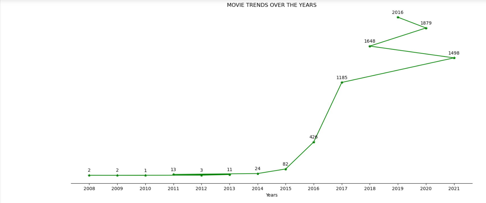

6. Uncover the most popular country-genre mix:
   ---

   To uncover the most popular country-genre mix, we would employ the following syntax:

   ```python

   # Grouping the DataFrame by 'Country' and 'Genre' and counting the occurrences
   country_genre_counts = df.groupby(['Country', 'Genre']).size().reset_index(name='count')

   # Sorting the grouped data by count in descending order and selecting the top 5
   top_country_genre = country_genre_counts.sort_values(by='count', ascending=False).head(5)

   # Creating a bar plot to visualize the top country-genre mixes
   fig, ax = plt.subplots(figsize=(12, 6))
   bars = ax.bar(range(len(top_country_genre)), top_country_genre['count'], align='center', color='green')

   # Adding labels to the bars indicating the count of each mix
   for bar, value in zip(bars, top_country_genre['count']):
      ax.text(bar.get_x() + bar.get_width() / 2, bar.get_height(), str(value), ha='center', va='bottom')

   # Setting x-axis ticks to display country-genre combinations
   plt.xticks(range(len(top_country_genre)), [f"{country} - {genre}" 
   for country, genre in zip(top_country_genre['Country'], top_country_genre['Genre'])], rotation=0, ha='center')

   # Adding labels and title to the plot
   plt.xlabel('Country - Genre')
   plt.title('COUNTRY_GENRE MIX')

   # Removing y-axis ticks and unnecessary spines
   plt.yticks([])
   ax.spines['top'].set_visible(False)
   ax.spines['bottom'].set_visible(False)
   ax.spines['left'].set_visible(False)
   ax.spines['right'].set_visible(False)

   # Displaying the plot
   plt.show()
   ```
   Explanation:

   - The code first groups the DataFrame by 'Country' and 'Genre', and then computes the count of occurrences for each combination.
   - It then sorts the grouped data based on the count in descending order and selects the top 5 combinations.
   - A bar plot is created to visualize the top country-genre mixes, with bars representing the count of each mix.
   - Labels indicating the count of each mix are added to the bars.
   - The x-axis ticks are set to display the country-genre combinations.
   - Labels and title are added to the plot for clarity.
   - Y-axis ticks are removed for a cleaner appearance.
   - Unnecessary spines (top, bottom, left, right) are hidden to improve visualization aesthetics.
   - Finally, the plot is displayed using plt.show().


   MOST POPULAR COUNTRY_GENRE MIX
   :------------------------------------------------:
   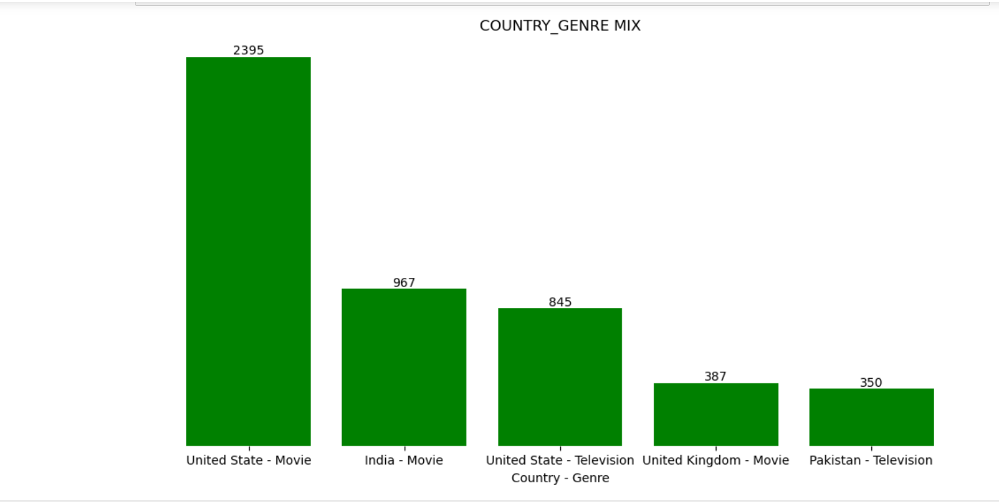

7. Calculate and visualize countries with the highest average movie duration.
   ---
   To compute and visualize countries with the highest average movie duration, you can use the following syntax:
   ```python
   # Calculating the average movie duration for each country
   average_duration = df.groupby('Country')['Duration'].mean().round(0)

   # Selecting the top 3 countries with the highest average movie duration
   top_countries = average_duration.sort_values(ascending=False).head(3)

   # Creating a pie chart to visualize the distribution of movie duration across the top countries
   plt.pie(top_countries, labels=top_countries.index, autopct='%1.1f%%', startangle=90, 
   colors=['yellow', 'lightblue', 'skyblue'])

   # Adding title to the plot
   plt.title('Top Three Countries With The Highest Average Movie Duration')

   # Displaying the plot
   plt.show()
   ```
   Explanation:

   - The code first computes the average movie duration for each country by grouping the DataFrame by 'Country' and calculating the mean duration.
   - It then selects the top 3 countries with the highest average movie duration by sorting the average duration values in descending order and selecting the top 3.
   - A pie chart is created using plt.pie() to visualize the distribution of movie duration across the top countries.
   - Labels for each slice of the pie chart are set to the country names, and the autopct parameter formats the percentage values displayed on each slice.
   - The startangle parameter rotates the pie chart to start from the 90-degree angle.
   - Custom colors are assigned to each slice for better visualization.
   - Finally, a title is added to the plot to provide context to the visualization, and the plot is displayed using plt.show().
  
   COUNTRIES WITH THE HIGHEST AVERAGE MOVIE DURATION 
   :------------------------------------------------:
   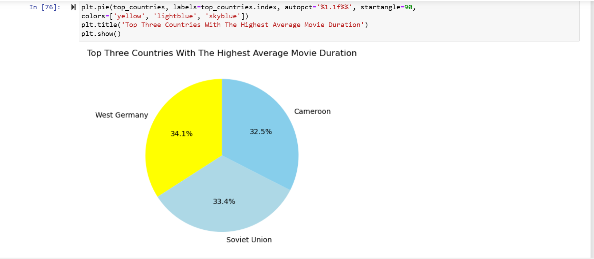

## RECOMMENDATION

Based on the analysis conducted in this project, several insights have been gleaned regarding the trends and characteristics of the movie dataset. Moving forward, it is recommended to further explore and analyze specific genres, directors, and countries that contribute significantly to the movie industry. Additionally, conducting sentiment analysis or audience reviews could provide deeper insights into audience preferences and trends, thereby informing decision-making processes for movie production and distribution.

## CONCLUSION

In conclusion, this project successfully explored and analyzed a diverse dataset of movies, uncovering valuable insights into movie production trends, popular directors, country-genre mixes, and average movie durations. Through meticulous data cleaning and insightful visualization techniques, we have gained a better understanding of the dynamics within the movie industry. By leveraging these findings, stakeholders can make informed decisions to enhance movie production strategies, cater to audience preferences, and contribute to the continued growth and evolution of the cinema landscape. This project serves as a foundation for further research and analysis in the domain of movie data analysis.


   


   
   


      


  


   


