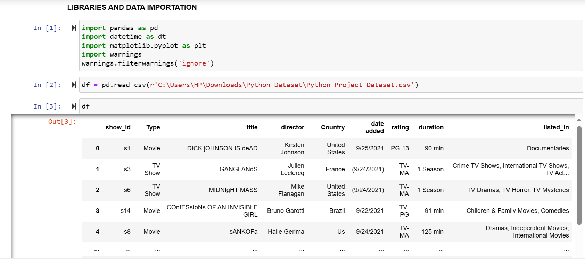
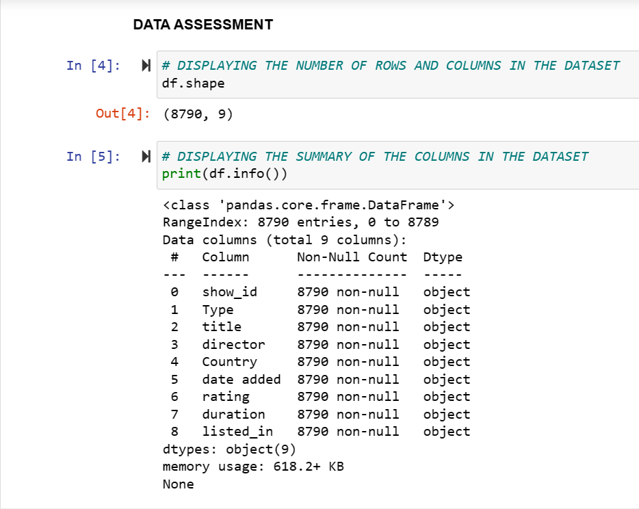
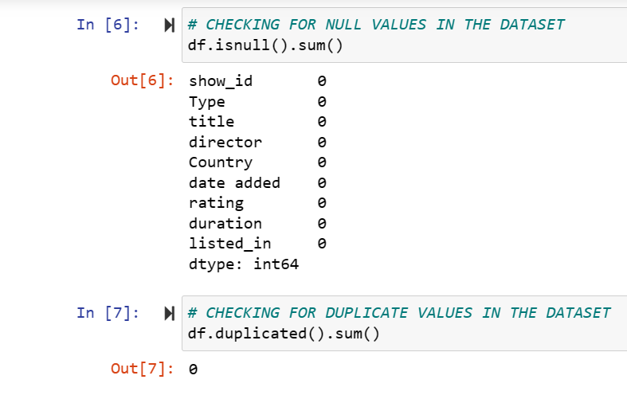
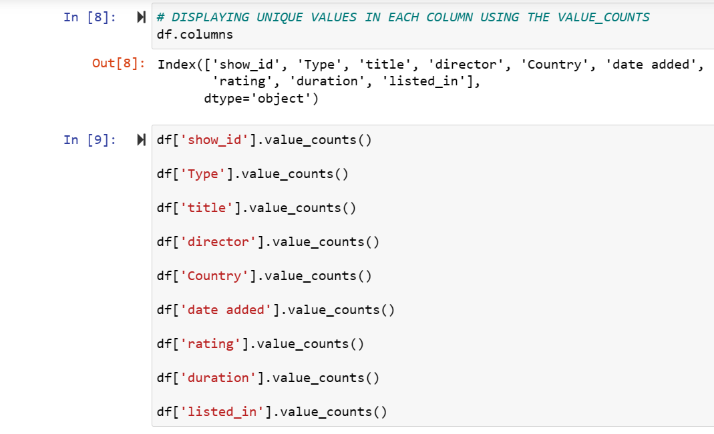
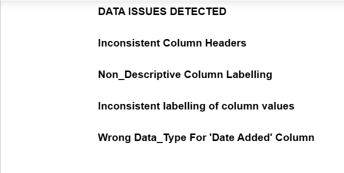

# MOVIE DATA ANALYSIS

## INTRODUCTION

Welcome to "Movie Data Analysis," a project delving into a comprehensive dataset with 8,790 rows of movie information. In this endeavor, we set out on an engaging journey to uncover hidden narratives within this extensive dataset, employing Python as our primary tool. Our key objectives encompass meticulous data cleaning and the use of visualization tools such as Seaborn or Matplotlib. Through this process, our aim is to unveil patterns, trends, and intriguing insights within the vast world of movie. Join us in this exploration, where the precision of Python-based data cleaning and the creativity of visualization converge to reveal the narratives embedded within 8,790 rows of movie information. The focus is on ensuring data accuracy and clarity in visual representations, offering detailed insights by addressing questions related to the most popular director, movie production trends, top and bottom movie-producing countries, and more. Let's dive into the world of movies and uncover the compelling stories behind the data!

## PROBLEM STATEMENT

1. Data Cleaning:
   - Scrutinize column names and data types for standardization.
   - Extract the year and month from the date column to facilitate visualization.
   - Calculate the number of days from a movie's release date to the current date for temporal context.
     
2. Identify the most popular director
3. Determine the top 5 and bottom 5 countries in terms of movie production.
4. Analyze and visualize trends in movie production over different years.
5. Uncover the most popular country-genre mix
6. Calculate and visualize countries with the highest average movie duration.

By addressing these challenges, this project aims to enrich the exploration of movie data, offering valuable insights through a combination of precise data cleaning and informative visualizations.

## SKILLS AND CONCEPTS DEMONSTRATED
In the exploration of "Movie Data" project using Python, the following skills and concepts are essential to demonstrate:

1. Data Cleaning and Preprocessing:
   - Ability to review and standardize column names and data types
2. Data Visualization with Seaborn or Matplotlib:
   - Proficiency in creating various types of plots, including bar plots, line plots, etc 
   - Skill in customizing visualization elements like colors, labels, titles, and legends
3. Data Analysis and Exploration:
   - Understanding and applying exploratory data analysis (EDA) techniques to identify patterns and trends in the dataset.
4. Statistical Analysis:
   - Employing statistical measures to calculate averages, such as average movie duration.
5. Utilizing Python Libraries and Modules:
   - Competence in using Pandas for data manipulation and analysis
   - Integration of Seaborn or Matplotlib for data visualization.
6. Programming Proficiency in Python:
   - Writing clean, efficient, and well-documented Python code.
7. Annotations and Documentation:
   - Incorporating appropriate annotations in visualizations, including chart titles, axis labels, and legends.
8. Problem Solving and Critical Thinking:
   - Demonstrating problem-solving skills by addressing specific questions posed in the project
   - Applying critical thinking to interpret visualizations and derive meaningful insights.
9. Communication Skills:
   - Effectively communicating findings and insights derived from the data.

By showcasing proficiency in these skills and concepts, the project demonstrates a holistic understanding of data analysis, visualization, and interpretation using Python tools within the context of cinematic data exploration.

## STAGES TO NAVIGATE IN THE MOVIE DATA ANALYSIS PROJECT

The project comprises five critical stages essential for successful completion, which encompass:
1. Libraries and Data Importation
2. Data Assessment
3. Data Cleaning
4. Data Manipulation
5. Data Visualization

EXPLANATIONS
--
1. Libraries and Data Importation:
 ---
 The initial step of this project involves importing essential libraries suitable for the tasks. In this instance, I imported the following libraries: pandas, which is commonly aliased as 'pd' for data importation and manipulation; datetime, aliased as 'dt' to handle date data types; matplotlib.pyplot, aliased as 'plt' for data visualization; and the warnings library to handle any potential warnings encountered during the project.
 
 Once these libraries are imported, the subsequent step is to bring the movie dataset into the Jupyter environment as a DataFrame using the 'pd.read_csv()' function. The dataset is then assigned to a variable named 'df'. Consequently, whenever 'df' is referenced, the movie dataset appears.
 
 Below is the code snippet that accomplishes this task:
 ```python
import pandas as pd
import datetime as dt
import matplotlib.pyplot as plt
import warnings
warnings.filterwarnings('ignore')

df = pd.read_csv(r'C:\Users\HP\Downloads\Python Dataset\Python Project Dataset.csv')
df
```
The output generated by running this code is displayed in the snapshot below. It is essential to note that the ellipsis (...) present in the data importation output after number 4 indicates the existence of additional rows of information that are not fully displayed unless additional lines of code are used.
:----------:


2. Data Assessment
--- 
Data assessment is the fundamental process of evaluating imported data to determine its suitability and cleanliness for its intended purpose. There are two primary methods of data assessment: virtual assessment and programmatic assessment. In this case, programmatic assessment was utilized, which involves assessing data using codes, especially when dealing with datasets containing numerous rows and columns that cannot be feasibly examined manually.

Several attributes and functions provided by the pandas library were employed for data assessment, including:

- df.shape attribute: Provides the dimensions of the DataFrame (number of rows and columns).
- df.info() function: Displays a concise summary of the DataFrame, including the data types and memory usage.
- df.isnull().sum() function: Counts the number of missing values in each column.
- df.duplicated().sum() function: Counts the number of duplicate rows in the DataFrame.
- df[column_name].value_counts() function: Returns the frequency count of unique values in a specific column.
  
These assessments are illustrated in the snapshots below. The issues detected during the assessment process are outlined in snapshot "D".

A    |B    
:---:|:---:
|

C   |  D
:---:|:---:
|


3. Data Cleaning:
---


   


